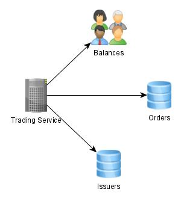

# GBM Trading project
## Compiling and Running
### Prerequisites
1. OpenJDK 10 or above
2. Maven

Using the command line of your choice, navigate to the project's folder and run the following command:
```
mvn clean install
```
Maven will compile the project first and then run the following tests:
* BuyStockTests
* ClosedMarketTests
* DuplicatedOperationTests
* InsufficientBalanceTests
* InsufficientStockTests

To provide a different orders list modify the **input** file located in **resources** and run **TradingConsoleApplication**, the output should look like the following:
```

  .   ____          _            __ _ _
 /\\ / ___'_ __ _ _(_)_ __  __ _ \ \ \ \
( ( )\___ | '_ | '_| | '_ \/ _` | \ \ \ \
 \\/  ___)| |_)| | | | | || (_| |  ) ) ) )
  '  |____| .__|_| |_|_| |_\__, | / / / /
 =========|_|==============|___/=/_/_/_/
 :: Spring Boot ::        (v2.2.1.RELEASE)

2019-12-08 21:57:52.665  INFO 40316 --- [           main] c.l.g.TradingConsoleApplication          : Starting TradingConsoleApplication on LEO-ASUS with PID 40316 (C:\Users\blink\src\gbm-trading\target\classes started by blink in C:\Users\blink\src\gbm-trading)
2019-12-08 21:57:52.669  INFO 40316 --- [           main] c.l.g.TradingConsoleApplication          : No active profile set, falling back to default profiles: default
2019-12-08 21:57:53.643  INFO 40316 --- [           main] c.l.g.TradingConsoleApplication          : Started TradingConsoleApplication in 1.52 seconds (JVM running for 2.399)
2019-12-08 21:57:53.644  INFO 40316 --- [           main] c.l.g.TradingConsoleApplication          : EXECUTING : Trading Service
2019-12-08 21:57:53.669  INFO 40316 --- [           main] c.l.g.TradingConsoleApplication          : {"initialBalances":{"cash":950,"issuers":[{"issuerName":"GBM","totalShares":15,"sharePrice":10}]},"businessErrors":[]}
2019-12-08 21:57:53.670  INFO 40316 --- [           main] c.l.g.TradingConsoleApplication          : DONE
```
## Architecture overview

* Trading Service: Processes all orders provided by the Orders service
* Balances: Contains account balances
* Issuers: Contains all Issuers operating within this simulated Stock Market 
## TODO
* Flowcharts
* Implement Orders, Balances and Issuers as true services